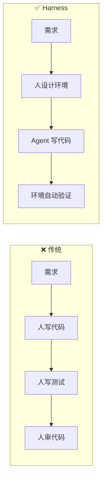
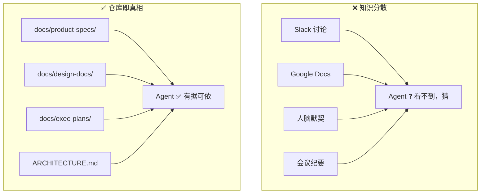
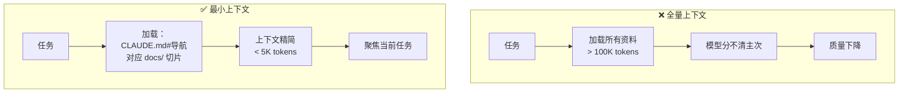
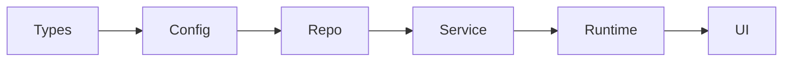
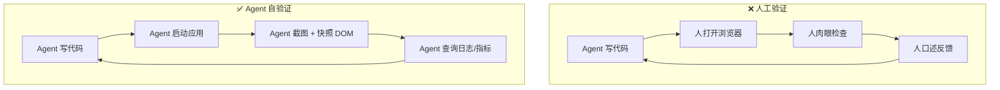
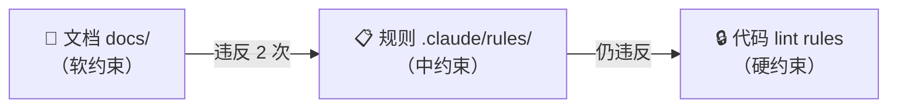
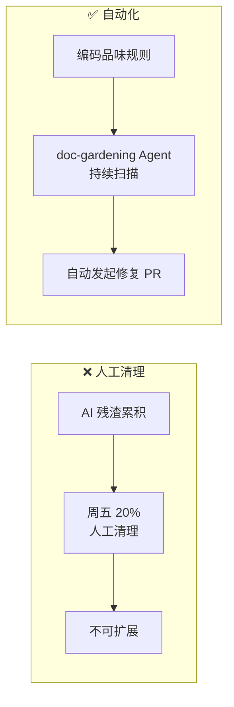
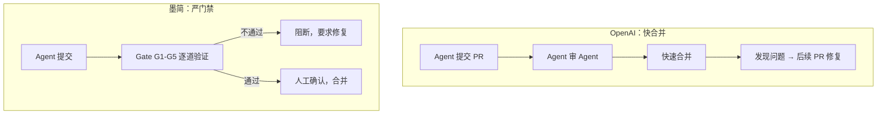

# Harness Engineering 实践教程

> 工程师的工作不再是写代码，而是设计 Agent 的运行环境。
> — OpenAI Codex 团队

OpenAI Codex 团队用 3 人在 5 个月内构建了 100 万行代码的产品，零人工编写。他们把这套方法叫做 Harness Engineering。我在自己的项目中验证了这些原则。以下是 8 条原则的拆解与实践。

---

## 0. 先看结果

同一个人，同一个模型（Claude Opus 4.6），同一个领域（简历编辑器）。两个项目，唯一的变量是有没有 Harness：

| 维度 | Typst（无 Harness） | 墨简（有 Harness） |
|---|---|---|
| API 调用 | UI 组件直接 fetch，散落各处 | Service 层单一入口，lint 强制 |
| 状态管理 | reducer 混合防抖、网络、dispatch | 分层隔离，状态管理只管状态 |
| 类型安全 | `as unknown as` 双重强转 | 叶子层 Types，全链路类型安全 |
| 测试 | 0 | 52（14 结构 + 38 单元） |
| 架构验证 | 无 | 自定义 ESLint + 结构测试 |
| 设计一致性 | 8/30 commit 修同类 UI bug | 三级令牌系统 + rules 约束 |
| 质量门禁 | 无 | QUALITY_SCORE < 40 阻断 Agent |

没有 Harness 时 Agent 写出什么样的代码？这是 Typst 项目的真实产出：

```tsx
// Typst: UI 组件直接发请求，没有服务层
const res = await fetch("/api/chat", {
  method: "POST",
  headers: { "Content-Type": "application/json" },
  body: JSON.stringify({ messages, resumeData, apiKey }),
});
```

```tsx
// Typst: Store 里同时做防抖、网络请求、状态管理
const compile = useCallback((d: ResumeData) => {
  if (compileTimer.current) clearTimeout(compileTimer.current);  // 防抖
  compileTimer.current = setTimeout(async () => {
    dispatch({ type: "COMPILE_START" });                          // 状态
    const res = await fetch("/api/compile", { ... });             // 网络
    dispatch({ type: "COMPILE_SUCCESS", svg: await res.text() }); // 状态
  }, 700);
}, []);
```

```tsx
// Typst: 双重类型强转，TypeScript 的类型检查变成摆设
data: setNestedField(
  state.data as unknown as Record<string, unknown>,
  action.path, action.value
) as unknown as ResumeData,
```

三个关注点耦合在一起，没法单独测试任何一个。类型系统被架空。**这不是模型能力问题，是没有人给 Agent 画过边界。**

---

## 1. 人类掌舵，Agent 执行

### 核心原则

**工程师的工作不再是写代码，而是设计 Agent 的运行环境。**

当 Agent 遇到困难时，解决方案不是"再努力一点"，而是"环境里还缺什么"。

### 传统方式 vs Harness 方式



### OpenAI 怎么做

3 名工程师，5 个月，100 万行代码，1500 个 PR。人类从未直接贡献过任何代码。

> "取得进展的唯一方式是让 Codex 来完成工作，而人类工程师则总是介入这项任务并追问：'究竟还需要什么样的能力，我们又该如何让这个能力对 Agent 来说既清晰可读又可强制执行？'"

### 墨简验证

5 个专职 Agent + 主控制器。人类只在 4 个触点介入：输入意图、审批文档、裁决问题、确认环境变更。

协议 5 "环境演进"定义了标准响应：

| Agent 症状 | 诊断 | 修复 |
|---|---|---|
| 输出不符预期 | 缺上下文 | 加 docs/ |
| 重复犯同一个错 | 缺约束 | 加 rules/ 或 lint |
| 无法完成任务 | 缺工具 | 加 scripts/ 或拆任务 |
| 输出质量低 | 指令不清 | 改 Agent 定义 |

Agent 失败 = 环境信号，不是 Agent 问题。

---

## 2. 仓库即记录系统

### 核心原则

**Agent 看不到的知识不存在。**

存在 Slack、Google Docs 或人脑中的知识，对 Agent 来说就是不存在的。

### 传统方式 vs Harness 方式



### OpenAI 怎么做

> "那次让团队在架构模式上达成一致的 Slack 讨论？如果 Agent 无法发现它，那么它就会像迟了三个月入职的新员工一样，对其一无所知。"

设计文档、执行计划、技术债务追踪全部版本化并提交到仓库。活跃计划、已完成计划和已知债务集中存放，Agent 无需依赖外部情境即可运行。

### 墨简验证

协议 3 "决策写入"：任何口头决策必须写入对应文档，否则不存在。

| 决策类型 | 写入位置 |
|---|---|
| 产品决策 | docs/product-specs/requirements.md |
| 技术决策 | docs/design-docs/tech-decisions.md |
| 行为修复 | .claude/rules/ |
| 设计决策 | docs/design-docs/ |

PIPELINE.md 是主控仪表盘，每次会话必须显式读取（不靠缓存引用，因为它变化频繁）。

墨简的仓库知识存储布局：

```
docs/
├── product-specs/
│   ├── intent.md              ← 原始意图（只读）
│   └── requirements.md        ← 结构化需求（req-review 输出）
├── design-docs/
│   ├── tech-decisions.md      ← 技术决策（tech-selection 输出）
│   ├── design-spec.md         ← 设计规范（design 输出）
│   └── core-beliefs.md        ← 系统信念与原则
├── exec-plans/
│   ├── active/                ← 进行中的执行计划
│   └── completed/             ← 已完成（归档参考）
└── references/                ← 外部 API 参考（Typst、OpenRouter）
ARCHITECTURE.md                ← 六层架构权威定义
CLAUDE.md                      ← Agent 地图（162 行导航索引）
docs/PIPELINE.md               ← 主控仪表盘（每次会话显式读取）
```

---

## 3. 地图，不是百科

### 核心原则

**给 Agent 一张地图，不是一本 1000 页的说明书。**

只加载当前任务需要的最小信息，不全量加载。

### 传统方式 vs Harness 方式



### OpenAI 怎么做

> "情境是一种稀缺资源。一个巨大的指令文件会挤掉任务、代码和相关文档。当一切都'重要'时，一切都不重要了。"

AGENTS.md 约 100 行，只做目录。知识库在结构化的 `docs/` 目录中，实现**渐进式披露**：Agent 从一个小而稳定的切入点开始，被指导下一步该去哪里查看。

专职 linter 和 CI 作业验证知识库的更新状况、交叉链接和结构正确性。

### 墨简验证

CLAUDE.md 162 行，只放路径导航：

```markdown
# 墨简 (Mojian) — Agent 地图

> 这是一张地图，不是说明书。细节在 docs/ 里。
> Agent 看不到的知识不存在——所有决策必须落库。

## 系统目标
**产品目标**：构建一个中古风 AI 驱动的简历编辑器。
**系统目标**：使 Agent 能够自主、可靠地构建和维护这个产品，
人类只在意图输入和裁决节点介入。

## 知识地图
- 产品规格 → docs/product-specs/
- 技术决策 → docs/design-docs/tech-decisions.md
- 设计规范 → docs/design-docs/design-spec.md
- 执行计划 → docs/exec-plans/active/
```

每个 Agent 按任务类型加载对应文档切片，不全量加载：

| Agent | 加载的文档 |
|---|---|
| req-review | intent.md + requirements.md |
| tech-selection | requirements.md + 技术候选 |
| design | requirements.md + tech-decisions.md |
| feature | exec-plan + ARCHITECTURE.md |

---

## 4. 分层架构与不变量强制

### 核心原则

**通过强制执行不变量，而非微观管理实现，让 Agent 快速交付且不削弱基础。**

约束边界，允许自主。中央强制边界，本地允许自由。

### 架构模型



只允许向右依赖。自定义 lint 和结构测试机械地强制执行。

### OpenAI 怎么做

> "这种架构通常要等到你拥有数百名工程师时才会推行。对于编码 Agent 来说，这是一个早期的先决条件：有了约束，速度才不会下降，架构才不会漂移。"

自定义 lint 的错误信息直接注入修复指令。Agent 看到错误就知道怎么修。

在边界处解析数据形状（parse, don't validate），但不规定具体实现方式。"在以人为本的工作流程中，这些规则可能会让人感到迂腐。有了 Agent，它们就成了倍增器。"

### 墨简验证

完全相同的六层模型，三层强制机制：

| 层级 | 机制 | 能绕过吗 |
|---|---|---|
| 硬 | 自定义 ESLint + trace.sh | 不能，构建失败 |
| 中 | .claude/rules/ | 自动注入，理论上能绕 |
| 软 | docs/ | 不读就不知道 |

```js
// eslint-rules/layer-dependency.js（精简版）
const ALLOWED_DEPS = {
  types:   ['types'],
  config:  ['config', 'types'],
  repo:    ['repo', 'config', 'types'],
  service: ['service', 'repo', 'config', 'types'],
  runtime: ['runtime', 'service', 'config', 'types'],
  ui:      ['ui', 'runtime', 'config', 'types'],
}
```

违反时错误信息直接注入修复指令（和 OpenAI 的做法一致）：

```
禁止从 ui 层引用 service 层。
允许的依赖方向：Types → Config → Repo → Service → Runtime → UI
修复方法：如需跨层通信，通过 Runtime 层中转，
或将共享逻辑下沉到 Types/Config 层。
```

在 ESLint 之上，14 个结构测试验证目录完整性和依赖关系：

```ts
// tests/structure/layers.test.ts
const ALLOWED_DEPS: Record<string, string[]> = {
  types:   ['types'],
  config:  ['config', 'types'],
  // ... 同上
  ui:      ['ui', 'runtime', 'config', 'types'],
}
// 遍历所有 .ts/.tsx，解析 import，验证目标层是否在允许列表中
```

ESLint 在编码时拦截，结构测试在 CI 时兜底。**Agent 没有办法绕过这些约束。**

新增机械化需求追踪：`trace.sh` 扫描代码中的 `@req` 注解，逐条核对需求覆盖率：

```bash
# scripts/trace.sh --strict
# 扫描 requirements.md 中的需求 ID（格式 ### N.M）
# 搜索 src/ 和 tests/ 中的 @req N.M 注解
# 报告覆盖率，--strict 模式下未覆盖则 exit 1
# pre-commit hook 调用，阻断未覆盖需求的提交
```

---

## 5. 让应用对 Agent 可读

### 核心原则

**不只是代码对 Agent 可读——UI、日志、指标都要让 Agent 能直接读取和操作。**

Agent 在运行时无法访问的信息就是不存在的。

### 传统方式 vs Harness 方式



### OpenAI 怎么做

三个层面的 Agent 可读性：

1. **UI 可读**：接入 Chrome DevTools 协议，Agent 能截图、快照 DOM、导航页面。每个任务启动独立的应用实例（基于 git worktree）。
2. **运行时可读**：本地可观测性堆栈——日志（LogQL）、指标（PromQL）、追踪（TraceQL）。任务完成后所有数据销毁。
3. **效果**："确保服务启动在 800ms 内完成"或"关键用户旅程的任何跨度不得超过两秒"这样的提示变得可行。

单次 Codex 运行可以持续工作超过 6 小时（通常在人类睡眠时间）。

> **注：** 这一原则我在墨简中尚未实践。以上是 OpenAI 的做法，展示了 Harness 的天花板。

---

## 6. 品味编码为工具

### 核心原则

**当文档不够，就把规则变成代码。**

人类的品味一旦被捕捉为工具，就会持续应用于每一行代码。

### 约束升级路径



**只升级，不降级。** 系统越跑越可靠。

### OpenAI 怎么做

> "审查评论、重构的 PR 和面向用户的 Bug 会被记录为文档更新，或直接编码到工具中。当文档不够完善时，我们会将规则转化为代码。"

自定义 lint 不只报错，错误信息里注入修复指令——Agent 不只看到"这里错了"，还看到"应该怎么修"。

编码为工具的"黄金原则"包括：结构化日志记录、命名约定、文件大小限制、平台可靠性要求。

### 墨简验证

协议 6 "约束升级"：同类违反 ≥3 次，自动升级：

```
docs/（软）→ .claude/rules/（中）→ lint rules（硬）
```

实际案例：AI 服务调用一开始写在 docs/ 里（"所有 AI 调用走 provider.ts"），两次被违反后升级为 `.claude/rules/ai-service.md`：

```markdown
# AI 服务调用规则

所有 AI 模型调用必须通过 `src/service/ai/provider.ts` 单一入口。
禁止在其他文件中直接实例化 AI 客户端。

违反此规则时：
1. 将直接调用移至 provider.ts
2. 在调用处改为引用 provider 导出的方法
```

放在 `.claude/rules/` 里，每次 Agent 启动时自动注入上下文。不需要 Agent 主动去读。

配图系统也经历了完整的约束迭代。从 33% 可用率到 100%，模型没换过，每一轮都是修 Harness：

- **33%**：Agent 选了隐喻（"灯塔"代表方向）但没展开为视觉规格。**修复**：加入隐喻展开三步法（选类型→定规格→验可读）
- **71%**：声明式规则列表（"必须做 X"）被模型跳过。**修复**：用引导式问题替代——"视线先落在哪里？" "超过 7 个元素就砍。"
- **100%**：Agent 在批处理，打断创意连贯性。**修复**：一句话——"对每张图，走完完整链路再做下一张。"
- **80%**：规模从 6 张扩到 15 张，新的系统性问题出现。**Harness 持续演进。**

**声明式规则容易被跳过，引导式问题更有效。** 同样的知识，换一种格式交付给 Agent，执行效果完全不同。

---

## 7. 熵管理与垃圾回收

### 核心原则

**技术债是高息贷款。小额持续偿还，好过让债务累积后一次性清算。**

Agent 会复现仓库中已存在的模式——包括不够理想的模式。

### 传统方式 vs Harness 方式



### OpenAI 怎么做

> "Codex 会复现代码仓库中已存在的模式——甚至包括那些不均衡或不够理想的模式。随着时间的推移，这不可避免地导致漂移。"

最初每周五花 20% 时间手动清理。不可扩展。改为定期运行后台 Codex 任务，扫描偏差、更新质量等级、发起重构 PR。"大多数都可以在一分钟内完成审查并自动合并。"

"人类的品味一旦被捕捉，就会持续应用于每一行代码。"

### 墨简验证

没有 Harness 时 Agent 的 Git 历史长这样——同类 UI bug 反复出现：

```
9d80419 fix: 大幅提升表单可读性 — 输入框加白底边框
629884f fix: 消除面板与画布之间的分界线
8be4e2d fix: 修复编辑面板对比度不足
ba8c7bd fix: 修复左上角品牌文字与编辑面板标题重叠
ca27b51 fix: 删除无用保存按钮 + 修复设置图标 viewBox 裁切
0680ea6 fix: 编辑面板默认打开 + 控件对比度提升
```

最近 30 条 commit 中有 8 条在修同类 UI 问题。**Agent 在没有设计令牌系统的情况下反复试错。** 改一处，另一处又坏了。

墨简的解法：doc-gardening Agent（用 Haiku 模型，轻量任务配小模型）持续扫描，加上 QUALITY_SCORE 量化追踪：

```
| 维度         | 满分 | 当前 |
|-------------|------|------|
| 需求覆盖     | 25   | 20   |
| 架构合规     | 25   | 23   |
| 文档新鲜度   | 25   | 22   |
| 测试覆盖     | 25   | 18   |
| 总分         | 100  | 83   |
```

总分低于 40，feature agent 和 design agent 自动阻断。任何单项低于 15，触发 doc-gardening 扫描。这构成闭环：Agent 输出 → 质量评分 → 分数过低 → 阻断 → 修复后才能继续。

---

## 8. 吞吐量与质量的平衡

### 核心原则

**纠错成本低时快合并，纠错成本高时严门禁。**

没有绝对正确的策略，只有匹配场景的选择。

### 两种策略对比



### OpenAI 的选择

> "在 Agent 吞吐量远超人类注意力的系统中，纠错成本低，而等待成本高。在低吞吐量环境中，这样做是不负责任的。而在这里，这通常是正确的选择。"

前提：7 名工程师专职维护，内部产品容错空间大，Agent 能快速修复。

### 墨简的选择

前提完全不同：1 个人，非工程师，无法逐行审代码。纠错成本高。

5 道 Gate（G1-G5）逐道验证完整链路：

```
Gate G1 → intent.md → requirements.md    溯源表验证意图覆盖
Gate G2 → requirements.md → tech-decisions.md  技术需求有决策
Gate G3 → requirements.md → design-spec.md     用户可见需求有设计
Gate G4 → requirements.md → exec-plan          每条需求映射 ≥1 个计划任务
Gate G5 → exec-plan → code                     trace.sh --strict（硬门禁）
```

G1-G4 由主控制器执行（中约束），G5 由脚本执行（硬约束）。

配图系统也有类似的门禁设计：

```yaml
# plan.lock.yaml — 上游锁定参数，下游不可覆写
density: standard
style_guide: digital-rationalism
negative_prompt: "no neon, no cyberpunk, no heavy texture..."
generation:
  model: gemini-3-pro-image-preview
  aspect_ratio: "16:9"
```

Gate 的设计原则是**成功静默，失败出声**。验证通过不输出任何信息，只有失败时才注入 Agent 上下文。

实际运行中发现了一个系统性 bug：**Agent 链路有损传递。**

```
intent.md（人类写）
  → req-review → requirements.md（完整）     ← 信息完整
  → plan agent → exec plan（可能漏条目）      ← 第一次丢失
  → feature agent → 代码（只看 plan）          ← 第二次丢失
  → 没有验证环节                               ← 无闭环
```

requirements.md 写了"富文本编辑 P0"，经过两次传递后被遗漏。链条越长，丢失越多。**修复**：Gate G5 用 trace.sh 机械化验证——代码里的 `@req` 注解必须覆盖 requirements.md 的每一条需求，否则 pre-commit hook 阻断提交。

**适用场景判断：**
- 有专职工程团队 + 内部产品 + Agent 能快速修复 → 快合并
- 个人/小团队 + 无法人工审代码 + 纠错成本高 → 严门禁

---

## 最小 Harness Checklist

任何项目都可以从这 5 个组件开始：

- [ ] **边界** — 在第一行业务代码前定义层级结构和依赖方向。做法：写 ESLint 规则或目录结构约束
- [ ] **地图** — CLAUDE.md / AGENTS.md 作为导航索引，不是百科全书。做法：≤160 行，只放路径，细节在 `docs/`
- [ ] **检查** — 自动化验证，构建时拦截违规。做法：结构测试 + CI 门禁
- [ ] **反馈** — 质量评分 + 阈值阻断。做法：QUALITY_SCORE < 40 阻断 Agent
- [ ] **角色** — 按职责拆分 Agent，文件做契约。做法：每个 Agent 的输出文件是下一个 Agent 的输入

先搭这 5 个。从失败中迭代。约束只升级，不降级。

---

## 结语

模型每个季度都在变强。"最好的模型"和"第二好的模型"之间的差距在缩小。

但"有 Harness 的 Agent"和"没有 Harness 的 Agent"之间的差距在扩大。

**先升级 Harness，再升级模型。**

---

## 参考资料

- [OpenAI: Harness Engineering](https://openai.com/index/harness-engineering/) — 本教程的主要参考
- [Mitchell Hashimoto: My AI Adoption Journey](https://mitchellh.com/writing/my-ai-adoption-journey)
- [Martin Fowler / Böckeler: Harness Engineering](https://martinfowler.com/articles/exploring-gen-ai/harness-engineering.html)
- [HumanLayer: Skill Issue — Harness Engineering for Coding Agents](https://www.humanlayer.dev/blog/skill-issue-harness-engineering-for-coding-agents)
- [Anthropic: Building Effective AI Agents](https://www.anthropic.com/research/building-effective-agents)

## 项目仓库

- [Typst 简历编辑器](https://github.com/Aryous/typst-resume)（无 Harness 对照组）
- [墨简 Mojian](https://github.com/Aryous/Mojian)（Harness 实验组）
- [LayerAxis 配图系统](https://github.com/Aryous/layeraxis-marketplace)（迭代案例）
- [本文及写作素材](https://github.com/Aryous/harness-engineering-in-practice)
